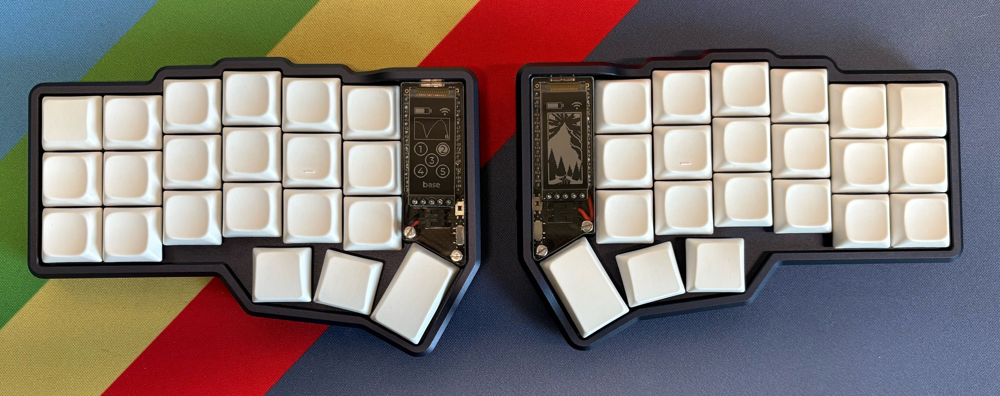
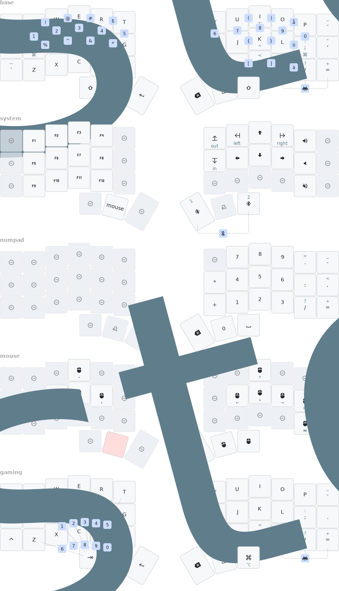

# Corne keyboard firmware configuration

My personal configuration of the wireless 6-column corne keyboard using
[ZMK](https://zmk.dev/) together with nickcoutsos
[keymap-editor](https://nickcoutsos.github.io/keymap-editor/). Heavily
influenced by [urob](https://github.com/urob/zmk-config)s meticulous
configuration. Latest firmware can be found under
[Actions](https://github.com/sieuwerts/zmk-config-corne/actions/workflows/build.yml).
This keymap is designed to work well for me as a software engineer, primarily
spending my time in neovim on macos.



## Keymap



I use a regular QWERTY layout with some modification of the symbols placement
on the default layer. The main reason for sticking with a QWERTY layout is
solely for the purpose of not having to configure neovim for another layout. I
know it's very much possible, but I like the mnemonic default mappings of
vim/neovim, and I don't want to mess around too much with it.

### Timer-less home row mods

I have adopted
[urob](https://github.com/urob/zmk-config?tab=readme-ov-file#timeless-homerow-mods)s
configuration for timer-less home row mods, all credit goes to them. See their
config repo for more information.

In short it aims to reduce misfires of home row mods while still being snappy
enough to not feel like you are being slowed down while typing fast. This is
achieved by setting up a `ZMK_HOLD_TAP` behaviour with the `balanced` flavor
and perhaps the most important feature for reducing misfires
`require-prior-idle-ms`. It also enforces some delay when used together with a
key on the same side of the keyboard. This works very well since the home row
mods are mirrored for each hand. See the configuration for more information.

### Combos vs layers

Coming from QMK, not (natively) having the option of requiring some idle time
in between key presses for triggering combos was a deal breaker for me.
Luckily, ZMK solved that by introducing `require-prior-idle-ms`. Before, I used
to have separate layers for a lot of functionality, like a layer for system
operations, Swedish letter keys (`åäö`), another one for symbols or numerals
etc. But it never felt really smooth while having to constantly jump between
momentary layers. So I tried reducing the amount of different layers by
replacing what felt natural with combos instead.

### Combos

I use two types of combos, vertical and horisontal. Most combos consist of two
keys that are right next to each other for better accessability. It took a
while to get used to vertical combos as they did not feel natural initially,
but I stuck with it and they feel more and more okay as time goes on.

#### Symbols

I have set up my most commonly used symbols as horisontal combos. For the left
hand, I have the top two rows used for the symbols that usually reside on the
number row in their respective traditional order. Starting with `!` and up
until `*`:

```{r, eval=FALSE}
   !   @   #   $
 ┌─┴─┬─┴─┬─┴─┬─┴─┐
[q] [w] [e] [r] [t]
[a] [s] [d] [f] [g]
 └─┬─┴─┬─┴─┬─┴─┬─┘
   %   ^   &   *
```

For the other hand, I have set up combos for my most commonly used brackets on
the "vertical" home row:

```{r, eval=FALSE}
   (   )
 ┌─┴─┬─┴─┐
[u] [i] [o]
   {   }
 ┌─┴─┬─┴─┐
[j] [k] [l]
   [   ]
 ┌─┴─┬─┴─┐
[m] [,] [.]
```

As for angle brackets, I simply use `shift` and `,`, `.` as one would normally
do. And the rest of the symbols are located directly on the default layer.

#### Numerals

Vertcal combos on the top two rows are dedicated for quick access of numerals,
in their traditional order, from `1` to `0`:

```{r, eval=FALSE}
1    2    3    4    5    6    7    8    9    0
├─[q]├─[w]├─[e]├─[r]├─[t]├─[y]├─[u]├─[i]├─[o]├─[p]
└─[a]└─[s]└─[d]└─[f]└─[g]└─[h]└─[j]└─[k]└─[l]└─[;]
```

#### Tab

Since I'm an avid neovim user, I cannot live without my dedicated `esc` button
in it's traditional spot due to muscle memory, I have set up `tab` as a
vertical combo around where it traditionally resides:

```{r, eval=FALSE}
tab
├─[esc]
└─[\]
```

#### International keys

I still want to be able to write in Swedish, as it is my main language, but I
don't want to switch to a different layer everytime I want to do so. So I set
out to be able to seamlessly switch between Swedish and English as if the
Swedish special keys (`åäö`) were directly on the default layer. With the
limited amount of keys I eventually ended up using vertical combos for these
keys where they traditionally reside on a Nordic ISO keyboard which turned out
really well.

```{r, eval=FALSE}
     å
ö    ├─[-] ä
├─[;]└─[']─┤
└─[/]  [=]─┘
```

NB: For this to work, I am using a custom variant of the ANSI QWERTY layout
called [EurKEY](https://eurkey.steffen.bruentjen.eu/) which enables me to
produce these characters through a combination of `ALT` + alphas. The rest of
the layout is similar to a regular ANSI layout.

#### Gaming layer toggle

I wanted an easy way to toggle my gaming layer, but also something that would
not accidentally trigger unintentionally. Which is why I went with a three key
horisontal combo at the very bottom of the right hand.

```{r, eval=FALSE}
[.][/][=]
 └──┼──┘
&tog gaming
```

#### Bluetooth profile clear

Choosing bluetooth profiles should be easily accessible, and it's currently
achieved through the momentary system layer and the right outermost thumb keys.
I also want to be able to clear a bluetooth profile, which is done by pressing
both profile keys at once. This is a "tricky" combo to perform by design
because it's not something that I want to do accidentally.

```{r, eval=FALSE}
# In system layer, right hand side
# [L]eft, [M]iddle & [R]ight thumb keys
# [M] is already held to get to this layer:
[L][M][R]
 └──┬──┘
clear profile
```

### Layers

Although combos are great, layers are still useful. I am very conservative of
adding more layers, and try to keep it to a minimum to keep it simple and
maintain a good flow when typing. I currently have three layers, one default
layer, a momentary system layer and a gaming toggle layer.

#### Default layer

As the name suggests, this is the default layer from which I aim to have most
functionality easily accessible. I use a QWERTY layout for the alphas while
using vertical combos for numerals (and tab since I want a dedicated esc key)
and horisontal combos for my most commonly used symbols. From here, I can
access the system layer by holding the right middle thumb key while tapping it
will produce a space. The outermost thumb keys on each hand triggers the hyper
key for convenience. The rest of the thumb keys are smart shift, backspace and
return.

#### System layer

The system layer (in lack of a better name) contains keys that I want to have
accessible, but does not have to be _as_ accessible as anything on the default
layer. This layer is only intended to be used as a momentary layer while
holding down a designated key. Here we have arrow keys bundled together with
home, end, page up and page down. The left thumb keys are for volume up, down
and mute while the right thumb keys are for selecting (and clearing) bluetooth
profiles. On the left hand, I also have a numpad cluster, which is also
convenient for when I want to write longer sequences of numbers. Having the
numbers on the default layer as combos are great for when I need quick access
to a number or two, but for writing e.g. phone numbers, having a numpad is
really convenient. So having both are complementing each other well. I also
have a few common number operators here, the ones that already exist on the
default layer keep their original place on the right hand, while the rest
reside next to the numpad cluster on the left hand.

#### Gaming layer

This is the last layer, and the only one which is meant to be toggled on/off.
It's meant to be used for playing video games, and has a three key combo to
toggle to avoid it being activated by accident. Here most of the fancy stuff
from the default layer is disabled such as home row mods and most combos. The
only combos that I still use here are for the numerals. Shift and control
have moved to their "traditional" spots on the left hand and the middle left
thumb button will become a spacebar. The rest of the thumb keys are designed to
provide common functionality while playing games. Since the right hand will
ususally be using a mouse, I really try to get as much in on the left side as
possible. No key (except for thumb keys on the right) will have separate "hold"
functionality, since it will interfere with gameplay. The system layer will
still be accessible from here if needed. This layer also has a custom combo
setup for the numerals for easy access with the left hand only.

### Smart shift

Also here, I have adopted some behaviour from the fantastic configuration of
[urob](https://github.com/urob/zmk-config?tab=readme-ov-file#capsword). The
middle left thumb key has three different functions:

- `tap`:

  - Sticky shift, will trigger shift behaviour for the next keypress only.

- `hold`:

  - Regular shift behaviour, will stay active until key is released.

- `double tap`:

  - Invoke ZMKs [caps_word](https://zmk.dev/docs/keymaps/behaviors/caps-word)
    behaviour.

The reason for having a dedicated key for shift instead of just relying on the
ones from the home row mods is that although it's convenient to use HRMs, shift
is the one key that's often used while just typing regular text (or when
_writing_ code). While having the required delay for triggering HRMs (and
combos, but we'll get to that later on) is a blessing, it does make it hard to
achieve `shift` functionality while writing fast. So I find that a combination
of the two complements each other really well.

### Hyper key

I have a dedicated `HYPER` key to use together with
[Raycast](https://www.raycast.com/) where I have set up shortcuts for
triggering certain applications or behaviours. e.g. `HYPER` + `B` will
focus/open my browser or `HYPER` + `T` for my terminal emulator.

## Notes

The keymap drawing is automatically generated using
[keymap-drawer](https://github.com/caksoylar/keymap-drawer). See the
[workflow](./.github/workflows/draw-keymaps.yml) for more details. It will be
generated everytime there are changes to the `config/corne.keymap` or
`keymap_drawer.config.yaml` files and push a new commit.

## Hardware

| **Component** | **Type** | **Model** | **Amount** | **Vendor** |
|---------------|-------------------|-----------------------------|-----------:|-----------------|
| PCB | 6-column Wireless | Choc v1 low profile | 1 set | typeractive.xyz |
| Case | Premium Aluminum | Midnight | 1 set | typeractive.xyz |
| Controller | nice!nano | v2.0 | 2 pcs | typeractive.xyz |
| Display | nice!view | With headers | 2 pcs | typeractive.xyz |
| Display cover | Acrylic | Clear | 1 set | typeractive.xyz |
| Sockets | EZ-Solder | Machine sockets and headers | 2 set | typeractive.xyz |
| Keycaps | Hypersonic | Blue | 1 set | typeractive.xyz |
| Switches | Ambient Silent | Twilight | 42 pcs | splitkb.com |
| Battery | 110mAh Li-Po | 3.7V | 2 pcs | aliexpress.com |
| Firmware | ZMK | Latest | N/A | N/A |
